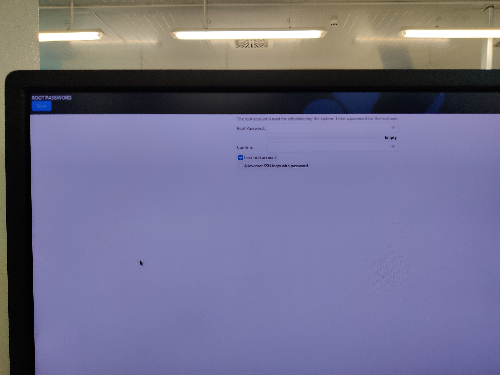
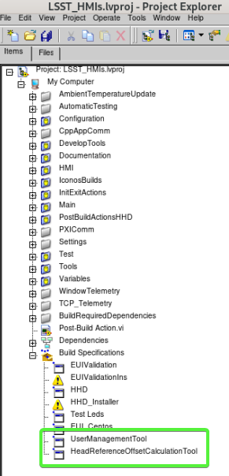

# Install Alma 9 MCC

- Download Alma 9 boot ISO and flash it into a USB drive.
- Insert the USB Drive in the server and boot from the USB.
- Select the GUI installation method.
  - Select time zone.
  - Select keyboard layout.
  - Software selection: Gnome Desktop.
  - Disk partitioning
    - Select the 3 available drives.
    - Configure manual disk partitioning and partition the disks as follows:

      
      
      
      

  - Configure the network as needed.
  - Lock *root* user:

    

  - Create *lsst* user:
    - Name: lsst.
    - Set a password.
    - Select make this user admin.

    

  - Begin installation.
  - Installation complete.
  - Check that the partitions are okay.
    - Execute:

    ```bash
    lsblk
    ```

    - The result should look like the following:

      ```bash
      NAME        MAJ:MIN RM   SIZE RO TYPE  MOUNTPOINTS
      sda           8:0    0 894.3G  0 disk
      ├─sda1        8:1    0    16G  0 part
      │ └─md127     9:127  0    16G  0 raid1 [SWAP]
      ├─sda2        8:2    0     2G  0 part
      │ └─md125     9:125  0     2G  0 raid1 /boot/efi
      └─sda3        8:3    0 876.2G  0 part
        └─md126     9:126  0 876.1G  0 raid1 /
      sdb           8:16   0 894.3G  0 disk
      ├─sdb1        8:17   0    16G  0 part
      │ └─md127     9:127  0    16G  0 raid1 [SWAP]
      ├─sdb2        8:18   0     2G  0 part
      │ └─md125     9:125  0     2G  0 raid1 /boot/efi
      └─sdb3        8:19   0 876.2G  0 part
        └─md126     9:126  0 876.1G  0 raid1 /
      nvme0n1     259:0    0 894.3G  0 disk
      ```

## Create telemetry saving directory

- Create a partition in the disk for the telemetry.
  - Open gdisk tool -> `sudo gdisk /dev/nvme0n1`
  - If the drive has no partition table, create one -> `o`
  - add a new partition -> `n`
    - leave everything to default by pressing ENTER multiple times
  - write table to disk and exit -> `w`
  - exit the gdisk tool -> `q`
- Format the created partition to `ext4` -> `sudo mkfs.ext4 /dev/nvme0n1p1`
- Get the *uuid* for the partition -> `ls -l /dev/disk/by-uuid/`
- Add the partition to *fstab*
  - `sudo vim /etc/fstab`
  - Add this line to the existing file to mount the partition at boot:

    `UUID=5664642c-9418-4ae9-a6db-8d68ec392807 /mnt/telemetry        ext4    defaults        0 0`
  
  - Save and close the file
- Create *telemetry* folder -> `sudo mkdir /mnt/telemetry`
- Reload daemon -> `sudo systemctl daemon-reload`
- Mount the folder -> `sudo mount /mnt/telemetry/`
- Change ownership for the telemetry folder -> `sudo chown -R lsst:lsst /mnt/telemetry/`
- Reboot the system to check that changes are applied.
- Check the drives -> `lsblk`

  ```bash
  NAME        MAJ:MIN RM   SIZE RO TYPE  MOUNTPOINTS
  sda           8:0    0 894.3G  0 disk
  ├─sda1        8:1    0    16G  0 part
  │ └─md127     9:127  0    16G  0 raid1 [SWAP]
  ├─sda2        8:2    0     2G  0 part
  │ └─md125     9:125  0     2G  0 raid1 /boot/efi
  └─sda3        8:3    0 876.2G  0 part
    └─md126     9:126  0 876.1G  0 raid1 /
  sdb           8:16   0 894.3G  0 disk
  ├─sdb1        8:17   0    16G  0 part
  │ └─md127     9:127  0    16G  0 raid1 [SWAP]
  ├─sdb2        8:18   0     2G  0 part
  │ └─md125     9:125  0     2G  0 raid1 /boot/efi
  └─sdb3        8:19   0 876.2G  0 part
    └─md126     9:126  0 876.1G  0 raid1 /
  nvme0n1     259:0    0 894.3G  0 disk
  └─nvme0n1p1 259:1    0 894.3G  0 part  /mnt/telemetry
  ```

## Add `motd`

Include some identifying text into the `/etc/motd` file, for example:

```bash

███    ███  ██████  ██████      █████  ██      ███    ███  █████       █████
████  ████ ██      ██          ██   ██ ██      ████  ████ ██   ██     ██   ██
██ ████ ██ ██      ██          ███████ ██      ██ ████ ██ ███████      ██████
██  ██  ██ ██      ██          ██   ██ ██      ██  ██  ██ ██   ██          ██
██      ██  ██████  ██████     ██   ██ ███████ ██      ██ ██   ██      █████
                                                                  by TEKNIKER

```

> [Tool used](https://patorjk.com/software/taag/#p=display&f=ANSI%20Regular&t=mcc)

## Install useful tools

- `sudo yum install git git-lfs traceroute`
- Add *lazygit*
  - Add lazygit repo -> `sudo dnf copr enable atim/lazygit`
  - `sudo yum install lazygit`
- Add *btop*, *bat*
  - Add epel repo -> `sudo dnf install epel-release`
  - `sudo dnf install btop bat`
- Enable *cockpit*
  - `sudo systemctl enable --now cockpit.socket`
  - This is a web interface for managing the hardware
    - For example change the power settings to performance
    - Change the time zone to UTC
- Add *oh-my-posh*
  - `curl -s https://ohmyposh.dev/install.sh | bash -s`
  - Add these lines to the `.bashrc` file:

    ```bash
    alias la="ls -la"
    alias lh="ls -lh"
    
    eval "$(oh-my-posh init bash --config 'https://raw.githubusercontent.com/julen-garcia/oh-my-posh-themes/refs/heads/main/amro_customized.omp.json')"
    ```

## [Install docker](https://wiki.crowncloud.net/?How_to_Install_Docker_on_AlmaLinux_9)

- Add repo -> `sudo dnf config-manager --add-repo=https://download.docker.com/linux/centos/docker-ce.repo`
- `sudo dnf -y  install docker-ce --nobest`
- Enable docker -> `sudo systemctl enable --now docker`
- Check docker OK -> `systemctl status  docker`
- Create docker group if not created already -> `sudo groupadd docker`
- Add your user to the docker group -> `sudo usermod -aG docker $USER`
- Log out and log back in so that your group membership is re-evaluated.
- Configure Docker to start on boot with systemd
  
  ```bash
  $ sudo systemctl enable docker.service
  $ sudo systemctl enable containerd.service
  ```

## Install the MtMount Operation Manager

Follow the steps defined at the README of [this repository](https://github.com/lsst-ts/ts_tma_operation-manager_mt-mount-operation-manager).

- Create a folder for the `docker-compose.yml` file -> `mkdir -p /home/lsst/LSST/mtmount-operation-manager-docker`
- Download the docker-compose file from the repo and place it in the folder.
- Log into the github docker repo.
- Launch the docker compose -> `docker compose up -d`

## Open ports for HHD communication

For sending and receiving data from/to the HHD some tcp ports must be opened. To do so follow these steps:

- Execute this command to open the right ports:

```bash
sudo firewall-cmd --zone=public --add-port=50006/tcp --permanent --zone=public --add-port=40005/tcp --permanent --zone=public --add-port=50005/tcp --permanent --zone=public --add-port=40006/tcp --permanent --zone=public --add-port=7500/tcp --permanent --zone=public --add-port=3306/tcp --permanent --zone=public --add-port=3015/tcp --permanent --zone=public --add-port=50013/tcp --permanent --zone=public --add-port=50015/tcp --permanent --zone=public --add-port=50035/tcp --permanent --zone=public --add-port=50016/tcp --permanent --zone=public --add-port=50017/tcp --permanent --zone=public --add-port=30005/tcp --permanent
```

- Reload the firewall:

```bash
sudo firewall-cmd --reload
```

- Check that the ports are opened:

```bash
$ sudo firewall-cmd --list-all

public (active)

target: default

icmp-block-inversion: no

interfaces: enp0s25 enp4s0 enp5s0

sources:

services: dhcpv6-client ssh

ports: 50006/tcp 40005/tcp 50005/tcp 40006/tcp 7500/tcp 3306/tcp 3015/tcp 50013/tcp 50015/tcp 50035/tcp 319/udp 320/udp 50016/tcp 50017/tcp 30005/tcp

protocols:

masquerade: no

forward-ports:

source-ports:

icmp-blocks:

rich rules:
```

## Install database

TODO: when ready to be deployed in Chile

- Clone the repository to `/home/lsst/LSST`

```bash
cd /home/lsst/LSST

git clone git@github.com:lsst-ts/ts_tma_mariadb-docker.git
```

- Update repository:

```bash
cd /home/lsst/LSST/mariadb-docker

git pull
```

- Go to `/home/lsst/LSST/mariadb-docker`
- Start the docker service:

```bash
docker-compose up -d
```

- Get the last backup database available and copy it to: `./backup`

  Copy the three files:

  - lsst_AppData-XXX.sql.gz
  - lsst_events-XXX.sql.gz
  - lsst_settings-XXX.sql.gz

- Create database

```bash
sudo ./createdatabases.pl
```

- Restore last backup database. The script will choose the most recent backup.

```bash
sudo ./restoredatabases.pl
```

- Edit contrab file to execute the python code that generates the backups:

```bash
sudo crontab -e
```

- Add the following lines (Note: that the paths may change for each specific installation.):

```bash
5 12 * * * /home/lsst/LSST/mariadb-docker/createbackup.pl

5 13 * * * docker run --rm -v /home/lsst/LSST/mariadb-docker/python:/script -v /home/lsst/LSST/mariadb-docker/backup:/backup python:3.7 python /script/main.py
```

- Save and exit crontab editor.

## Install LV 2024

- Download LabVIEW 2024 Q3 64bit pro installer for linux.
- Install the *rhel9* version -> `sudo dnf install ./ni-labview-2024-pro-24.3.5.49154-0+f2-rhel9.noarch.rpm`
- Install the *appbuild* and *core* packages -> `sudo dnf install ni-labview-2024-appbuild-24.3.5.49154-0+f2.x86_64 ni-labview-2024-core-24.3.5.49154-0+f2.x86_64`

### Install [VIPM](https://www.vipm.io/)

First, download your copy of VIPM for Linux at: [VIPM](https://www.vipm.io/download/) if you haven't.

- Unzipping the VIPM ZIP file
  - create the installation directory -> `sudo mkdir -p /usr/local/JKI/VIPM/`
  - unzip the files -> `sudo unzip vipm-22.1.2354-linux.zip -d /usr/local/JKI/VIPM`
- Enable VI server in the LabVIEW installation.
- Run VIPM from the Terminal -> `sudo /usr/local/JKI/VIPM/vipm`
- Download the latest VIPM configuration from [**here**](https://github.com/lsst-ts/ts_tma_vipm_dependency)
  - Note that the file is big and is uploaded using git-lfs
- Execute VI Package Manager.
- Verify that VI Package Manager can connect to LabVIEW. If not:
  - Open LabView and change the LabVIEW configuration, going to Tools/options/VI Server and active the TCP/IP port and ensure that the port corresponds with the port at the VI Package Manager.
    - On the VI Package Manager, got to Tools->Options->LabView
- Install the configuration file downloaded from github repo.

## Add libraries

### Add libGetClocks.so

There are two options for doing this:

- If LV 2024 and the tekniker packages are installed
  - Create soft link to the `*.so` that gets the TAI time:

    ```bash
    sudo ln -s /usr/local/natinst/LabVIEW-2024-64/vi.lib/Tekniker/getClocksLabview/getclockssharedobject/libGetClocks.so /usr/local/lib/libGetClocks.so
    ```

- If there is no LV installation in the server
  - Download the `libGetClocks.so` and place it in `/usr/local/lib/`

## Install EUI

- Download the latest rpm (rpm name **tma_eui**) from [LSST nexus repo](https://repo-nexus.lsst.org/nexus/#browse/browse:ts_yum:releases).
- Install the rpm -> `sudo dnf install ./tma_eui-6.5.0-1.el9.x86_64.rpm`

## Install VNC

- Install VNC server

  ```bash
  sudo dnf install tigervnc-server
  ```

- Set a password for the user

  ```bash
  vncpasswd
  ```

- Copy the template for the Systemd service

  ```bash
  sudo cp /lib/systemd/system/vncserver@.service /etc/systemd/system/vncserver@:1.service
  ```

- Edit the configuration for the VNC to set the vnc user, in this case `lsst`.

  ```bash
  sudo vim /etc/tigervnc/vncserver.users
  ```

  The result should look like this:
  
  ```bash
  $ sudo cat /etc/tigervnc/vncserver.users
  # TigerVNC User assignment
  #
  # This file assigns users to specific VNC display numbers.
  # The syntax is <display>=<username>. E.g.:
  #
  # :2=andrew
  # :3=lisa
  :1=lsst
  ```

- Edit the configuration for the VNC to set the vnc screen resolution, in this case `1920x1080`.

  ```bash
  sudo vim /etc/tigervnc/vncserver-config-defaults
  ```

  The result should look like this:
  
  ```bash
  $ sudo cat /etc/tigervnc/vncserver-config-defaults
  ## Default settings for VNC servers started by the vncserver service
  #
  # Any settings given here will override the builtin defaults, but can
  # also be overriden by ~/.vnc/config and vncserver-config-mandatory.
  #
  # See HOWTO.md and the following manpages for more details:
  #     vncsession(8) Xvnc(1)
  #
  # Several common settings are shown below. Uncomment and modify to your
  # liking.

  # session=gnome
  # securitytypes=vncauth,tlsvnc
  geometry=1920x1080
  # localhost
  # alwaysshared

  # Default to GNOME session
  # Note: change this only when you know what are you doing
  session=gnome
  ```

- Enable and launch the service

  ```bash

  sudo systemctl daemon-reload

  sudo systemctl start vncserver@:1

  sudo systemctl status vncserver@:1

  sudo systemctl enable vncserver@:1
  ```

## Create telemetry folders

- For telemetry and log storing create the following folders:
  - `/mnt/telemetry/AlarmHistory`
  - `/mnt/telemetry/ErrorHistory`
  - `/mnt/telemetry/MemoryLogging`

### Remove old log files from the telemetry directory

- Download the `main.py` script from [this repo](https://github.com/lsst-ts/ts_tma_python_filehistorydeletion)
- Make 4 copies, name and modify them as follows :
  - *removeOldAlarmFiles.py*: in this copy replace the global variables as shown below:

    ```python
    files_directory = "/mnt/telemetry/AlarmHistory"
    date_search_pattern = 'Alarm_File_(\d\d\d\d)_(\d\d)_(\d\d)'
    months_to_keep = 12
    ```

  - *removeOldErrorFiles.py*: in this copy replace the global variables as shown below:

    ```python
    files_directory = "/mnt/telemetry/ErrorHistory"
    date_search_pattern = 'SoftwareErrorFile_(\d\d\d\d)_(\d\d)_(\d\d)'
    months_to_keep = 12
    ```

  - *removeOldMemoryLoggingFiles.py*: in this copy replace the global variables as shown below:

    ```python
    files_directory = "/mnt/telemetry/MemoryLogging"
    date_search_pattern = 'MemoryLogging_(\d\d\d\d)_(\d\d)_(\d\d)'
    months_to_keep = 2
    ```

  - *removeOldWindowNavigationFiles.py*: in this copy replace the global variables as shown below:

    ```python
    files_directory = "/mnt/telemetry/MemoryLogging"
    date_search_pattern = 'WindowNavigationLogging_(\d\d\d\d)_(\d\d)_(\d\d)'
    months_to_keep = 4
    ```

- Call this 4 scripts from crontab
  - Edit crontab for the default user `crontab -e`
  - Add the following lines:

    ```bash
    35 9 * * * python3 /mnt/telemetry/AlarmHistory/removeOldAlarmFiles.py
    40 9 * * * python3 /mnt/telemetry/ErrorHistory/removeOldErrorFiles.py
    45 9 * * * python3 /mnt/telemetry/MemoryLogging/removeOldMemoryLoggingFiles.py
    50 9 * * * python3 /mnt/telemetry/MemoryLogging/removeOldWindowNavigationFiles.py
    ```

    > Note that in this case the 4 scripts are placed in different places, for this crontab task to work the scripts
    > must be placed there or the path to them must be changed when editing the crontab task

## Install HeadReferenceOffsetCalculationTool and UserManagementTool

- Build the tools from the [EUI repo](https://github.com/lsst-ts/ts_tma_labview_hmi-computers) in the *LSST_HMIs.lvproj*

  

- HeadReferenceOffsetCalculationTool:
  - Copy the build to `/usr/local/TMA_HeadReferenceOffsetCalculationTool`
- UserManagementTool:
  - Copy the build to `/usr/local/TMA_UserManagementTool`

## Install SettingsDatabaseEditor

- Build the tool from [this repo](https://github.com/lsst-ts/ts_tma_labview_settings-database-editor)
- Copy the build to `/usr/local/TMA_SettingsDatabaseEditor`
