# Deployment

| **Requested by:** | **LSST**         |
| ----------------- | ---------------- |
| **Doc. Code:**    | 3151_MCS_0036    |
| **Editor:**       | Julen Garcia     |
| **Approved by:**  | Alberto Izpizua  |

## Introduction

This document describes the deployment procedure for all elements in TMA.

The document has a section for each element in the TMA that needs deployment actions. In this sense the are deployment
sections for:

- [Mount Control Computer (MCC)](#mount-control-computer)
- [Development PC](#development-pc)
- [Handheld device (HHD)](#hhd)
- [TMA PXI](#tma-pxi)
- [Axes PXI](#axes-pxi)
  - [cRIO 9144](#ethercat-crio-9144)
- [AuxSystems PXI](#auxsystems-pxi)
- [Bosch Rexroth drive system](#bosch-rexroth-drive-system)
- [Watlow RMC](#watlow-temperature-controller)
- [Phoenix Contact IOs](#phoenix-contact-ios)

## Mount Control Computer

The computer in the control room is the responsible of running the Engineering User Interface, EUI, and
the MtMount_operation_manager (developed in C++).

This computer also contains the database for the settings.

All those elements are described in next subsections.

The computer operating system is Centos 7 (centos-release-7-3.1611.el7.centos.x86_64).

### EUI

The EUI is based on LabVIEW 2020 64 bits for Linux.

For deploying the EUI software the project called `LSST_HMIs.lvproj` is needed. It can be found in
[**this**](https://gitlab.tekniker.es/aut/projects/3151-LSST/LabVIEWCode/HMIComputers) git repository.

Steps to run the EUI code:

1. Open the `LSST_HMIs.lvproj`.
2. Navigate to the Main folder at the project browser.
3. Open the `HMIMain_EUI.vi` and run it.
4. This will launch the required tasks to run the EUI.

#### Configuration file

This file contains the general configuration of the application, the file can be found inside the git repo
`HMIComputers/Configuration/HMIConfig.xml`. As part of the deployment procedure, it is important to check that the
following items are correct before launching the app:

- IPs values are correct. Check the value of the IPs and verify that the values are correct. The main IPs are:
  - `TMAConnectionData.Remote_Adress` here the IP must point to the MCC machine, where the MTMount Operation Manager is going to run.
  - `AlarmsForHHDClientConnectionData.Remote_Adress` here the IP must point to the MCC machine, where the EUI will be running, this is used by the HHD.
  - `Database_Settings.Host_IP` here the IP must point to the MCC machine, where the settings database is located.
  - `TekNsvClientConfiguration0.Remote_Adress` here the IP must point to the TMA PXI, for reading the variables from it.
  - `TekNsvClientConfiguration1.Remote_Adress` here the IP must point to the AuxSystems PXI, for reading the variables from it.
  - `Actual_Commander_Data.Actual_commader_url` here the IP of the commander variable must point to the TMA PXI.
- Path values are correct. Check the value of the paths and verify that the values are correct. The main paths are:
  - `Alarm_History_Path` this path refers to a directory where the alarm/warning history files will be stored.
  - `UsersDefinitionPath` this path refers to the file where the users for the EUI are defined.
  - `ErrorTaskDirectoryPath` this path refers to a directory where the software error files will be stored, this path is
  built as an array of folders, but works in the same way as the others.
  - `File_Saving_directory_path` this path refers to a directory where the telemetry history files will be stored.
  - `HMIWindowsTelemetryVariables_file_path` this path refers to the file that defines the variables for each window.
  - `TelemetryTopics_file_path` this path refers to the file that defines the variables for each topic.
  - `WindowTelemetryDirectoryPath` this path refers to a directory where the window telemetry files will be stored, this
  path is built as an array of folders, but works in the same way as the others.

### Installing everything from scratch

This section describes how to install all the required software for the MCC. Each main task is explained in a specific
section.

#### Requirements before starting the installation

For following the upcoming sections first get the following:

- Centos 7 ISO image version: centos-release-7-3.1611.el7.centos.x86_64
- LabVIEW 2015 32 bit installation files
- LabVIEW 2020 32 & 64 bit installation files
- Wireflow User Toolkit installation files
- LabVIEW libraries from Tekniker
- [VI Package Manager](https://vipm.jki.net/download)

#### Configure the PC to be RAID 0

- Open boot menu by pressing ESC on startup.
- Select "SCU" from the menu.

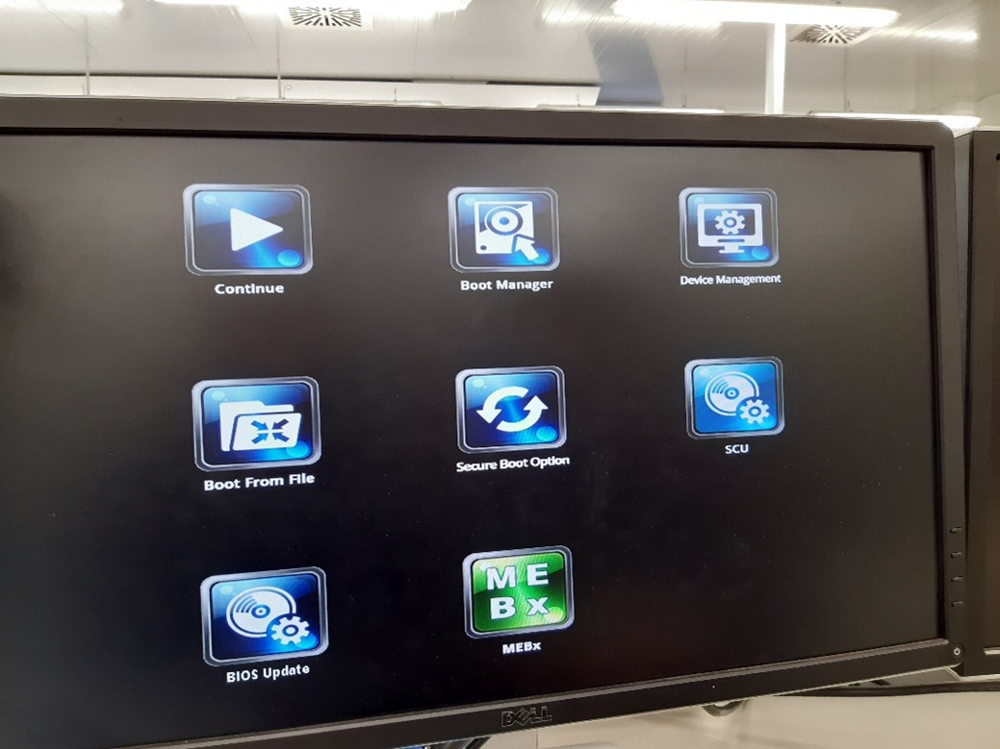

- In the "SCU" go to Advanced > SATA Configuration.

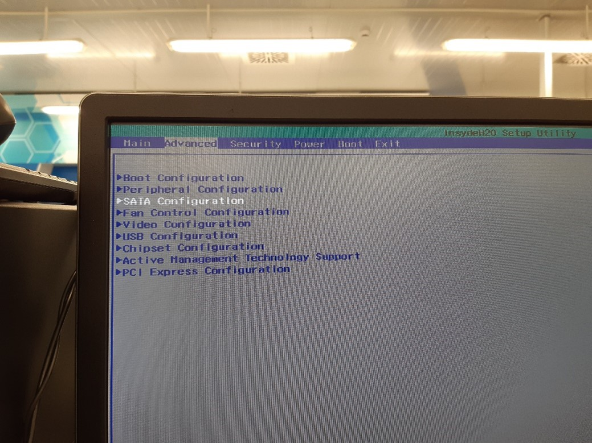

- Select HDC Configure as "RAID".

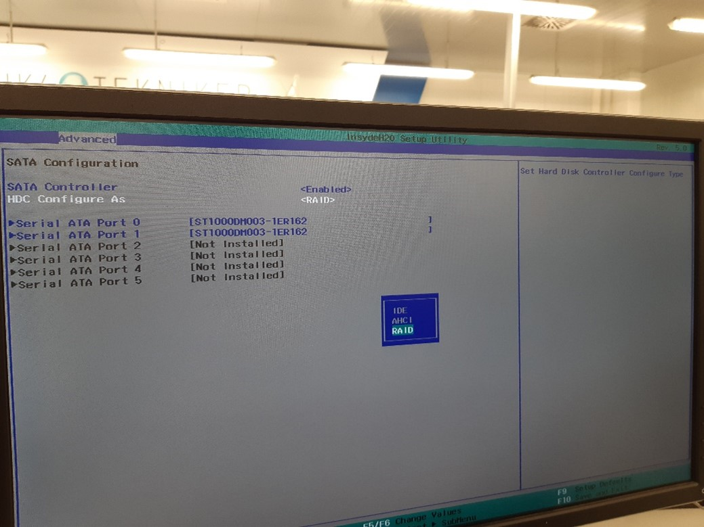

- Save and exit.
- The system reboots, now press `crtl + I`
- The RAID configuration will appear, select "Create RAID Volume".

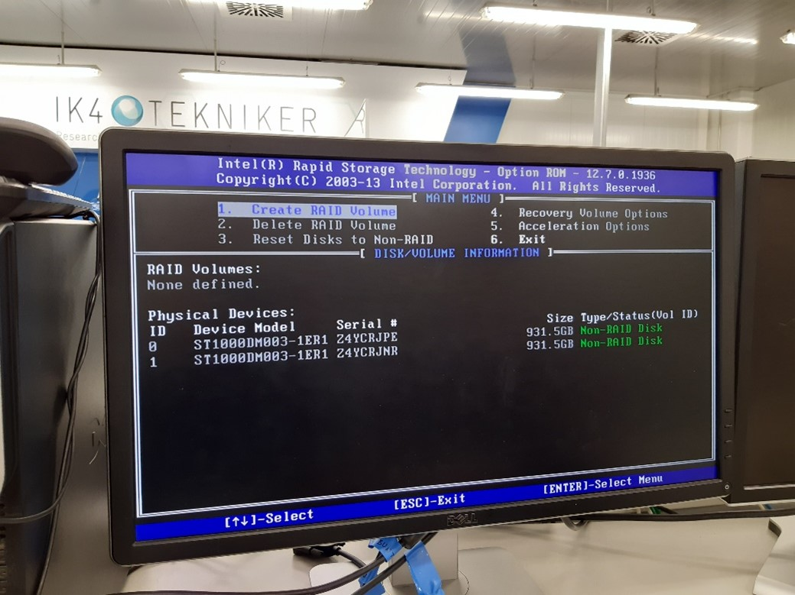

- Select RAID 1 as the image bellow and press Create Volume:

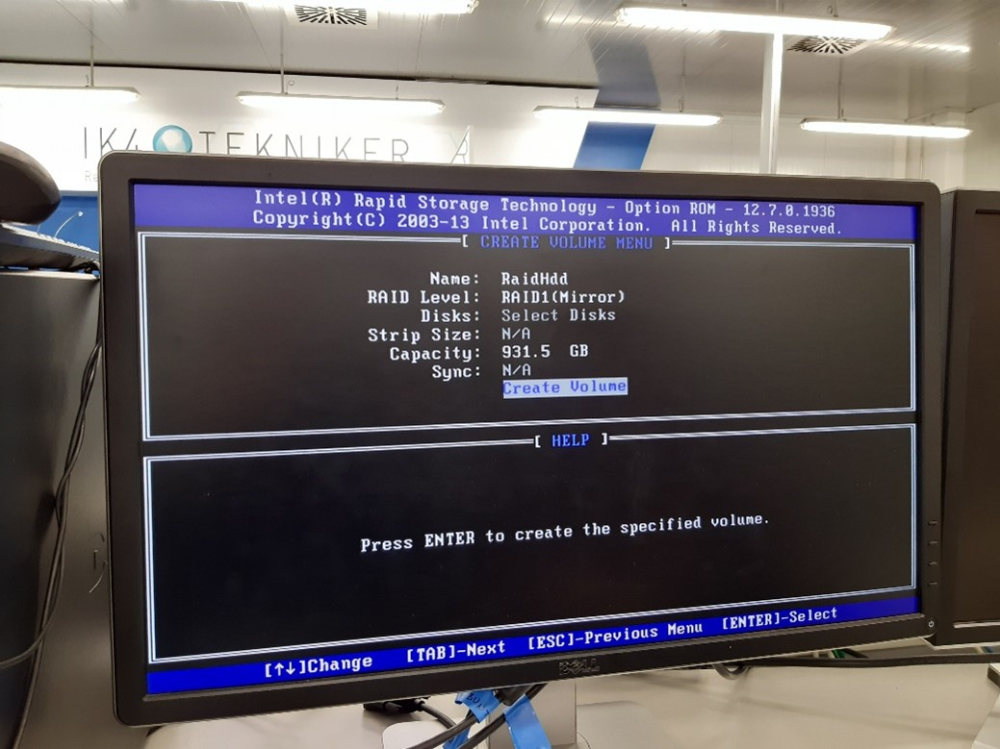
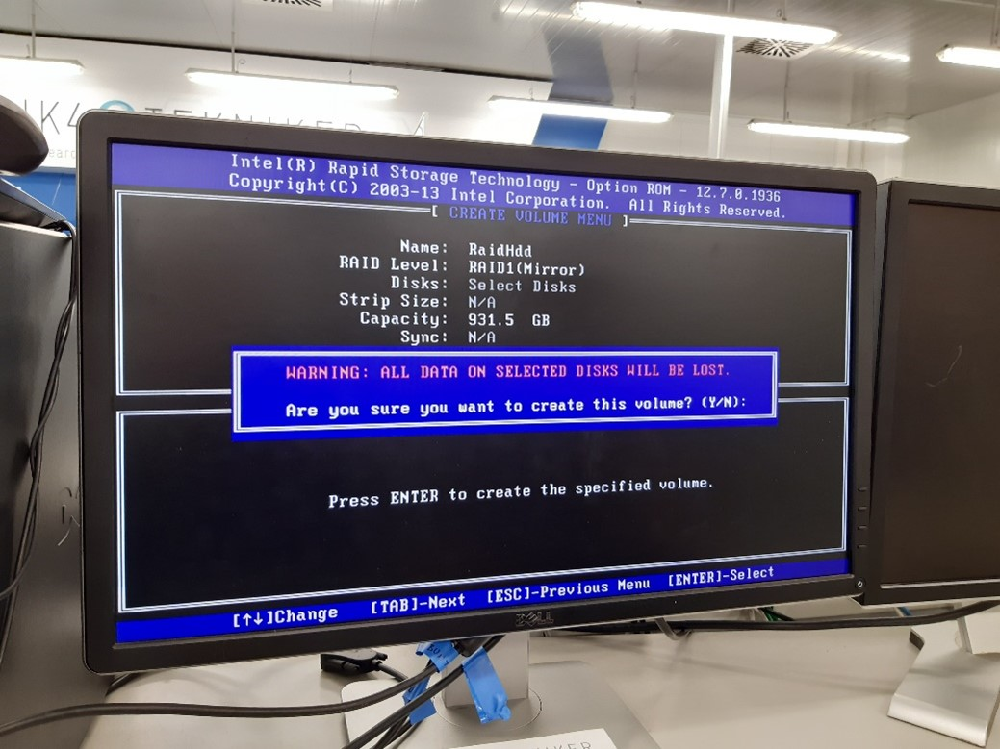

- Exit the RAID menu.

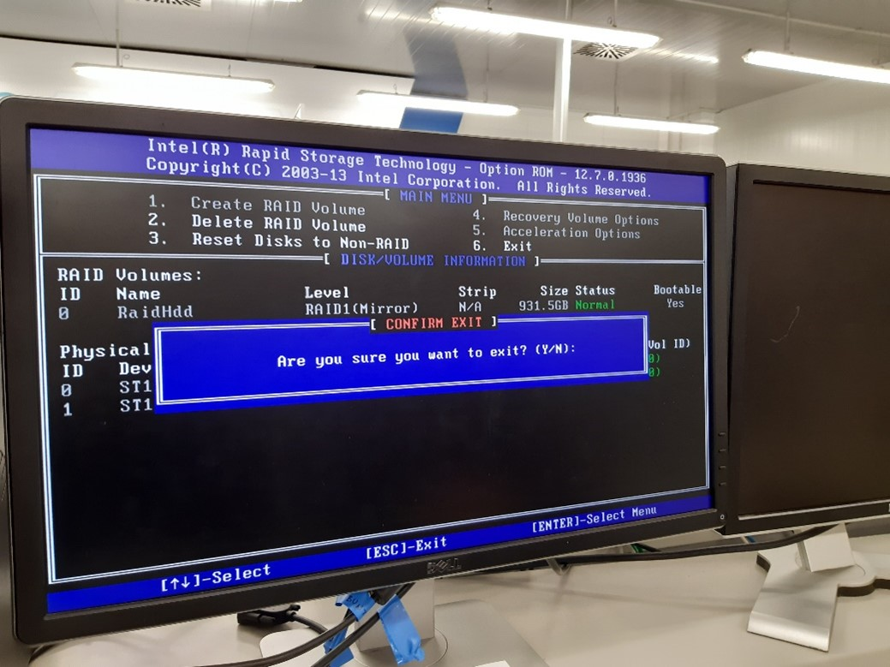

- The RAID 1 is now configured, the Centos 7 installation can start.

#### Install Centos 7

- Download the Centos 7 version: centos-release-7-3.1611.el7.centos.x86_64. Install it following the installation steps:
  - Run the Centos image from a USB drive.
  - Click install.
  - Select time zone.
  - Select keyboard layout.
  - Software selection: Gnome Desktop.
  - Installation Destination, select the RAID set and "I will configure partitioning".

  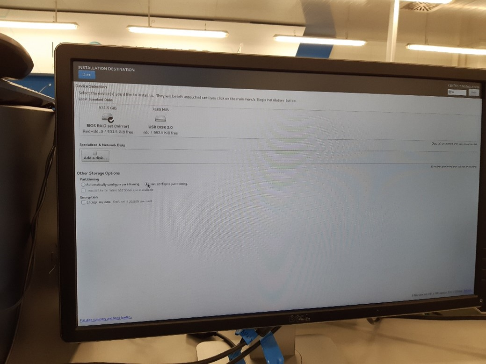

  - Select partitioning scheme LVM and create the partitions as the image bellow:

  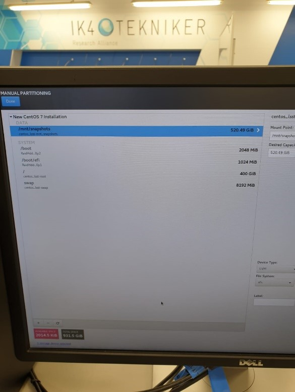

  - Network.
    - Host name: lsst.
    - Enable networks.
      - Internet interface set to DHCP
        - IP: DHCP
        - Mask: 255.255.255.0
        - Interface: enp0s25
      - TMA PXI interface set to:
        - IP: 192.168.209.200
        - Mask: 255.255.0.0
        - Interface: enp4s0
      - Telescope network interface:
        - IP: 192.168.2.200
        - Mask: 255.255.255.0
        - Interface: enp5s0
  - Begin installation.
  - Create root password.
  - Create admin user.
    - Name: lsst.
    - Set a password.
    - Select make this user admin.
  - Installation complete.
  - Check that the partitions are okay.
    - Execute:

    ```bash
    lsblk
    ```

    - The result should look like the following:

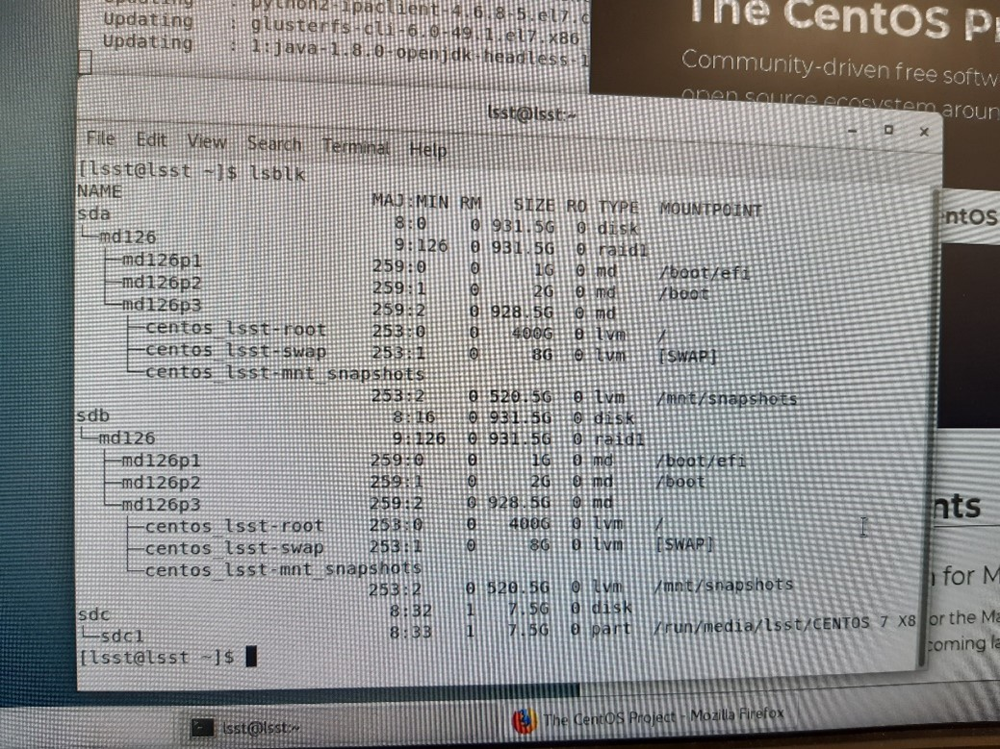

#### Install git

The following steps were taken from [this source.](https://linux4one.com/how-to-install-git-on-centos-7/#1_Install_Git_on_CentOS)

- Prerequisites: Before you start installing Git on CentOS 7. You must have the non-root user account on your Server or Desktop with sudo privileges.
- Install Git on Centos: To install latest Git in CentOS you will need to enable GIT repository in CentOS.
  - First, create a new file inside /etc/yum.repos.d/ directory using following command:

  ```bash
  sudo nano /etc/yum.repos.d/wandisco-git.repo
  ```

  - Copy the lines bellow inside the created file:

  ```bash
  [wandisco-git]

  name=Wandisco GIT Repository

  baseurl=http://opensource.wandisco.com/centos/7/git/$basearch/

  enabled=1

  gpgcheck=1

  gpgkey=http://opensource.wandisco.com/RPM-GPG-KEY-WANdisco
  ```

  - Now save and exit the editor typing CTRL+X then typing 'Y'.
  - Next, Import GPG key for added repository key typing below command:

  ```bash
  sudo rpm --import http://opensource.wandisco.com/RPM-GPG-KEY-WANdisco
  ```

  - Now install Git by typing following command:

  ```bash
  sudo yum install git
  ```

  - Confirm the installation and check the version executing the following command:

  ```bash
  git --version
  ```

  - The output should be:

  ```bash
  git version 2.18.0
  ```

- Setting up git. To prevent warning every time you should configure it perfectly by using your Git information.
  - Set the global username for Git:

  ```bash
  git config --global user.name "User Name"
  ```

  - Set global email for Git:

  ```bash
  git config --global user.email "username@domain.com"
  ```

  - You can also change above configuration by editing .gitconfig file. To edit gitconfig file type:

  ```bash
  nano ~/.gitconfig
  ```

#### Install the MtMount Operation Manager

Follow the steps defined at the doc of [this repository](https://gitlab.tekniker.es/aut/projects/3151-LSST/OperationManager/lsst/-/blob/develop/tma_management/doc/tma_management_program.md).

#### Install LabVIEW prerequisites

For installing LabVIEW installing the VI package manager is required, is a third-party tool used to install LabVIEW
libraries. At the time this was made the VI package manager required the LabVIEW 2015 installed to run properly. A
previous LabVIEW version as 2015 must be installed before installing a newer version, otherwise it throws an error.
That's why LV 2015 is installed as a prerequisite. VI package manager will be installed in [this section](#labview-dependencies-installation).

- Required libraries

```bash
sudo yum install glibc.i686 libstdc++.so.6 libXinerama.i686
sudo yum upgrade gnome-packagekit-common
sudo yum install libglvnd-glx-1.0.1-0.8.git5baa1e5.el7.i686
```

- Install the full version of LabVIEW 2015 32 bit, this is the base that the VI package manager uses.
  - Follow the LabVIEW installation script and install everything.

```bash
sudo sh ./INSTALL
```

| LabVIEW 2015 32 bit |
|-----|
| labview-2015-appbuild-32bit-15.0.1-1.i386 |
| labview-2015-core-32bit-15.0.1-1.i386 |
| labview-2015-desktop-32bit-15.0.1-1.i386 |
| labview-2015-examples-32bit-15.0.1-1.i386 |
| labview-2015-exe-32bit-15.0.1-1.i386 |
| labview-2015-help-32bit-15.0.1-1.i386 |
| labview-2015-pro-32bit-15.0.1-1.i386 |
| labview-2015-ref-32bit-15.0.1-1.i386 |
| labview-2015-rte-15.0.1-1.x86_64 |
| labview-2015-rte-32bit-15.0.1-1.i386 |

#### Install LabVIEW 2020 64 bit

For Linux there are multiple packages available when executing the installation script, install all the packages available.
For doing so follow the installation script and say yes to all the packages.

- Mount the iso:

```bash
sudo mkdir /mnt/iso
sudo mount -t iso9660 -o loop <LabVIEW_ISO_FileName>.iso /mnt/iso/
cd /mnt/iso
sudo ./INSTALL
```

- When finished unmount the iso:

```bash
sudo umount /mnt/iso
```

| LabVIEW 2020 64 bit |
|-----|
| labview-2020-appbuild.x86_64-18.0.1-1 |
| labview-2020-core.x86_64-18.0.1-1 |
| labview-2020-desktop.x86_64-18.0.1-1 |
| labview-2020-examples.x86_64-18.0.1-1 |
| labview-2020-exe.x86_64-18.0.1-1 |
| labview-2020-help.x86_64-18.0.1-1 |
| labview-2020-pro.x86_64-18.0.1-1 |
| labview-2020-ref.x86_64-18.0.1-1 |
| labview-2020-rte.x86_64-18.0.1-1 |

##### LabVIEW dependencies installation

- Install VI package manager.
  - Download the VI package manager for Linux [link.](https://vipm.jki.net/download)
  - Follow the installation guide. (As LabView 2015 runtime was installed previously, do not install LabView 2015 runtime again).
- Execute VI Package Manager.
- Verify that VI Package Manager can connect to LabVIEW. If not:
  - Open LabView 2020 and change the LabVIEW configuration, going to Tools/options/VI Server and active the TCP/IP port and ensure that the port corresponds with the port at the VI Package Manager.
    - On the VI Package Manager, got to Tools->Options->LabView
- Install the required dependencies using the VI Package Manager, dependencies to install: see Table 3. Note: the WF User Access Toolkit (FUNDACION TEKNIKER) is not available at VI package manager by default, it must be installed from the files provided by Tekniker.
  - If there is a permission error while installing the WF Access Toolkit (FUNDACION TEKNIKER) execute the following commands:

  ```bash
    cd /usr/local/natinst/LabVIEW-2020-64/vi.lib/addons/WireFlow/

    sudo chmod 777 _AC0061\ Fingerprint\ Reader\ driver _AC0061\ Fingerprint\ Reader\ driver_internal_deps/
  ```

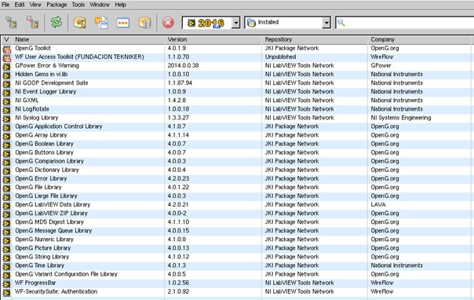

| VI package manager add-ons |
| --- |
| GPower All Toolsets-2017.0.0.11 |
| GPower Array-2016.2.0.27 |
| GPower Comparison-2016.0.0.4 |
| GPower Error & Warning-2014.0.0.38 |
| GPower Math-2012.1.0.6 |
| GPower Numeric-2016.2.0.14 |
| GPower Overflow-2014.0.0.4 |
| GPower String-2016.1.0.11 |
| GPower Timing-2014.0.0.19 |
| GPower VI Launcher-2012.2.0.26 |
| GPower VI Register-2016.0.0.31 |
| Hidden Gems in vi.lib-1.0.0.10 |
| NI Event Logger Library-1.0.0.9 |
| NI GOOP Development Suite-1.1.87.94 |
| NI GXML-1.4.2.8 |
| NI LogRotate-1.0.0.18 |
| NI Syslog Library-1.3.3.27 |
| OpenG Application Control Library-4.1.0.7 |
| OpenG Array Library-4.1.1.14 |
| OpenG Boolean Library-4.0.0.7 |
| OpenG Buttons Library-4.0.0.7 |
| OpenG Comparison Library-4.0.0.3 |
| OpenG Dictionary Library-4.0.0.4 |
| OpenG Error Library-4.2.0.23 |
| OpenG File Library-4.0.1.22 |
| OpenG LabVIEW Data Library-4.2.0.21 |
| OpenG LabVIEW ZIP Library-4.0.0-2 |
| OpenG Large File Library-4.0.0.3 |
| OpenG MD5 Digest Library-4.1.1.10 |
| OpenG Message Queue Library-4.0.0.15 |
| OpenG Numeric Library-4.1.0.8 |
| OpenG Picture Library-4.0.0.13 |
| OpenG String Library-4.1.0.12 |
| OpenG Time Library-4.0.1.3 |
| OpenG Variant Configuration File Library-4.0.0.5 |
| WF Fingerprint Reader-1.2.0.65 |
| WF User Access Toolkit (FUNDACION TEKNIKER)-1.1.0.70 |
| WF-SecuritySuite: Authentication-2.1.0.92 |
| WF-SecuritySuite: WF USB Security Dongle-2.1.1.116 |

- Copy the libraries created by Tekniker to the LabVIEW libraries at the LabVIEW installation destination.
  - Go to the LabVIEW installation directory:

  ```bash
  cd /usr/local/natinst/LabVIEW-2020-64
  ```

  - Copy the files to the LabVIEW installation directory (for this command the directories to copy were at the labview folder inside the Documents folder):

  ```bash
  sudo rsync -ra /home/lsst/Documents/labview/\* .
  ```

  - Modify the permissions of the folder:

  ```bash
  sudo chmod -R 777 ./\*
  ```

##### Making data sockets (NSVs) work when compiling the LabVIEW application

When building the compiled version of the LabVIEW application the data sockets were not working properly, we use data
sockets to read the Network Shared Variables. For solving this problem a link to certain library must be created, for
doing so, execute the following command (the solution comes from
[this LabVIEW forum](https://forums.ni.com/t5/LabVIEW/Datasocket-Open-Error-42-only-on-executable-Linux/m-p/3737996?profile.language=es#M1052103)):

```bash
sudo ln -s /usr/local/lib64/LabVIEW-2020-64/liblksock_impl.so /usr/local/lib64/liblksock_impl.so
```

#### Install docker

Docker installation steps, [source](https://docs.docker.com/install/linux/docker-ce/centos/)

Install using the repository. Before you install Docker CE for the first time on a new host machine, you need to set up
the Docker repository. Afterward, you can install and update Docker from the repository.

- Set up the repository.
  - Install required packages. yum-utils provides the yum-config-manager utility, and device-mapper-persistent-data
  and lvm2 are required by the devicemapper storage driver.

  ```bash
  sudo yum install -y yum-utils \
  device-mapper-persistent-data \
  lvm2
  ```

  - Use the following command to set up the stable repository.

  ```bash
  sudo yum-config-manager \
  --add-repo \
  https://download.docker.com/linux/centos/docker-ce.repo
  ```

- Install docker ce.
  - Install the latest version of Docker CE and containerd.

  ```bash
  sudo yum install docker-ce docker-ce-cli containerd.io
  ```

  - Start docker.

  ```bash
  sudo systemctl start docker
  ```

  - Verify that Docker CE is installed correctly by running the hello-world image.

  ```bash
  sudo docker run hello-world
  ```

  >This command downloads a test image and runs it in a container. When the container runs, it prints an informational
  message and exits.

#### Install database

Follow the steps below (source [Readme](https://gitlab.tekniker.es/aut/projects/3151-LSST/mariadb-docker)):

- Set up the repository:

```bash
sudo yum install -y yum-utils

sudo yum-config-manager \
--add-repo \
https://download.docker.com/linux/centos/docker-ce.repo
```

- Install:

```bash
sudo yum install docker-ce docker-ce-cli containerd.io
```

- Add the user to docker users:

```bash
sudo usermod -aG docker $USER
```

- Activate docker to automatically launch

```bash
sudo systemctl start docker
sudo systemctl enable docker
```

- Reboot machine

```bash
sudo reboot
```

- Install docker compose

```bash
sudo curl -L "https://github.com/docker/compose/releases/download/1.24.0/docker-compose-$(uname -s)-$(uname -m)" -o /usr/local/bin/docker-compose

sudo chmod +x /usr/local/bin/docker-compose
```

- Clone the repository to `/home/lsst/LSST`

```bash
cd /home/lsst/LSST

git clone https://gitlab.tekniker.es/aut/projects/3151-LSST/mariadb-docker.git
```

- Update repository:

```bash
cd /home/lsst/LSST/mariadb-docker

git pull
```

- Go to `/home/lsst/LSST/mariadb-docker`
- Start the docker service:

```bash
docker-compose up -d
```

- Get the last backup database available and copy it to: `./backup`

  Copy the three files:

  - lsst_AppData-XXX.sql.gz
  - lsst_events-XXX.sql.gz
  - lsst_settings-XXX.sql.gz

- Create database

```bash
sudo ./createdatabases.pl
```

- Restore last backup database. The script will choose the most recent backup.

```bash
sudo ./restoredatabases.pl
```

- Edit contrab file to execute the python code that generates the backups:

```bash
sudo crontab -e
```

- Add the following lines (Note: that the paths may change for each specific installation.):

```bash
5 12 * * * /home/lsst/LSST/mariadb-docker/createbackup.pl

5 13 * * * docker run --rm -v /home/lsst/LSST/mariadb-docker/python:/script -v /home/lsst/LSST/mariadb-docker/backup:/backup python:3.7 python /script/main.py
```

- Save and exit crontab editor.

#### Clone the HMI repository

Clone the code from the [HMI repository](https://gitlab.tekniker.es/aut/projects/3151-LSST/LabVIEWCode/HMIComputers).

```bash
cd /home/lsst/LSST/

git clone [_https://gitlab.tekniker.es/aut/projects/3151-LSST/LabVIEWCode/HMIComputers.git_](https://gitlab.tekniker.es/aut/projects/3151-LSST/LabVIEWCode/HMIComputers.git)

cd HMIComputers

git submodule update --init --recursive --remote
```

Create soft link to the `*.so` that gets the TAI time:

```bash
sudo ln -s /home/lsst/LSST/HMIComputers/getclockslabview/getclockssharedobject/libGetClocks.so /usr/local/lib/libGetClocks.so
```

Follow the steps to run the EUI code:

- Open the `LSST_HMIs.lvproj`.
- Navigate to the Main folder at the project browser.
- Open the `HMIMain_EUI.vi` and run it.
- This will launch the required tasks to run the EUI.

#### Install the ptp protocol

Firewall configuration for allowing the PTP protocol to work ([source](https://linuxize.com/post/how-to-setup-a-firewall-with-firewalld-on-centos-7/)).

- Get firewall zones

```bash
sudo firewall-cmd --get-zones
```

- Get active zones

```bash
sudo firewall-cmd --get-active-zones
```

- List everything in the active zone, in this case it was public

```bash
sudo firewall-cmd --zone=public --list-all
```

- Configure the system firewall to allow access by PTP event and general messages to UDP ports 319 and 320 in the appropriate zone, in this case public zone.

```bash
sudo firewall-cmd --zone=public --add-port=319/udp --add-port=320/udp

sudo firewall-cmd --permanent --zone=public --add-port=319/udp --add-port=320/udp
```

Follow the steps defined here to configure the PTP ([source](https://access.redhat.com/documentation/en-us/red_hat_enterprise_linux/7/html/system_administrators_guide/ch-configuring_ptp_using_ptp4l)).

- Download the PTP libraries:

```bash
sudo yum install linuxptp
```

- The ptp will be used as a service so the options file will manage the behavior of the ptp. The options file must be located in `/etc/sysconfig/ptp4l`

  `OPTIONS="-f /etc/ptp4l.conf"`

  - For connection as master or slave (actual configuration) the file is shown in next lines

    ```bash

    [global]

    verbose 1

    time_stamping hardware

    priority1 200

    priority2 200

    [enp4s0]

    ```

    - The priority1 and priority2 are chosen to be 200 to use as masterclock when running in standalone with PXIs, since the pxi will is set to 254 and the switch to 250. See
    - The section [enp4s0] defines the nic to use for ptp and it's configuration.
- Enable and start the service

```bash
sudo systemctl enable ptp4l

sudo systemctl start ptp4l
```

- To synchronize the system clock with the ptp clock or vice versa the phc2sys service is used. The configuration of this service is done in the `/etc/sysconfig/phc2sys`

  `OPTIONS="-a -r -r"`

  - The second -r allows to sync the system clock with ptp clock when it is the master
- Enable and start the service

```bash
sudo systemctl enable phc2sys

sudo systemctl start phc2sys
```

- To check ptp status

```bash
systemctl status phc2sys

systemctl status ptp4l

sudo cat var/log/messages
```

#### Create shared folder

Clone the shared folder [repository](https://gitlab.tekniker.es/aut/projects/3151-LSST/mccsharedfolder) and follow the steps at the readme file.

#### Open ports for HHD communication

For sending and receiving data from/to the HHD some tcp ports must be opened. To do so follow these steps:

- Execute this command to open the right ports:

```bash
sudo firewall-cmd --zone=public --add-port=50006/tcp --permanent --zone=public --add-port=40005/tcp --permanent --zone=public --add-port=50005/tcp --permanent --zone=public --add-port=40006/tcp --permanent --zone=public --add-port=7500/tcp --permanent --zone=public --add-port=3306/tcp --permanent --zone=public --add-port=3015/tcp --permanent --zone=public --add-port=50013/tcp --permanent --zone=public --add-port=50015/tcp --permanent --zone=public --add-port=50035/tcp --permanent --zone=public --add-port=50016/tcp -- permanent --zone=public --add-port=50017/tcp –permanent --zone=public --add-port=30005/tcp --permanent
```

- Reload the firewall:

```bash
sudo firewall-cmd --reload
```

- Check that the ports are opened:

```bash
$ sudo firewall-cmd --list-all

public (active)

target: default

icmp-block-inversion: no

interfaces: enp0s25 enp4s0 enp5s0

sources:

services: dhcpv6-client ssh

ports: 50006/tcp 40005/tcp 50005/tcp 40006/tcp 7500/tcp 3306/tcp 3015/tcp 50013/tcp 50015/tcp 50035/tcp 319/udp 320/udp 50016/tcp 50017/tcp 30005/tcp

protocols:

masquerade: no

forward-ports:

source-ports:

icmp-blocks:

rich rules:
```

#### Install VNC

- Install VNC server

```bash
sudo yum install tigervnc-server
```

- Set a password for the user

```bash
vncpasswd
```

- Copy the template for the Systemd service

```bash
sudo cp /lib/systemd/system/vncserver@.service /etc/systemd/system/vncserver@:1.service
```

- Edit the systemd service, here replace the `<USER>` in the file with the user that is going to run it, in our case `lsst`.

```bash
sudo nano /etc/systemd/system/vncserver@\:1.service
```

- Change the display resolution, for doing so modify the vncserver_wrapper file.

  - Open de vncserver_wrapper file:

  ```bash
  sudo nano /usr/bin/vncserver_wrapper
  ```

  - Modify the following line from the vncserver_wrapper file adding `-geometry 1920x1080`

  ```bash
  /usr/sbin/runuser -l "$USER" -c "/usr/bin/vncserver ${INSTANCE} -geometry 1920x1080"
  ```

- Enable and launch the service

```bash

sudo systemctl daemon-reload

sudo systemctl start vncserver@:1

sudo systemctl status vncserver@:1

sudo systemctl enable vncserver@:1
```

### Connect to the VNC in the MCC

- Connect to the Rubin VPN, if we are not in the local network already
- Open a SSH tunnel to the server, use the following command:

```bash
ssh -L 5901:localhost:5901 -N lsst@139.229.178.30
```

- Open the VNC client and connect to the following direction: `127.0.0.1:5901`
- Enter the VNC server password.
- Done you are now in the server user interface.

## Development PC

This section refers to the computer used to deploy the code to the PXIs. This computer must be a Windows computer. It needs to have LV 2020 installed, as well as the following packages (version of packages not updated):

| **INSTALLED SOFTWARE** | **VERSION** |
| --- | --- |
| **CompactRIO** | 20.0.0 |
| **C Series Module Support** | 20.0.0 |
| **CVI Runtime** | 17.0.0 |
| **NI-DAQmx Device Driver** | 20.0.0f0 |
| **NI-DAQmx ADE Support** | 20.0.0 |
| **NI-DAQmx MAX Configuration** | 20.0.0 |
| **NI Script Editor** | 20.0 |
| **NI-DMM** | |
| **NI 408x Device Support** | 20.0 |
| **Configuration Support** | 20.0 |
| **Development Support** | 20.0 |
| **NI 407x, NI 406x, and NI 4050 Device Support** | 20.0 |
| **Runtime Support** | 20.0 |
| **NI-FGEN** | |
| **Configuration Support** | 20.0 |
| **Development Support** | 20.0 |
| **Runtime** | 20.0 |
| **FGEN Soft Front Panel** | 20.0 |
| **NI-488.2 Runtime** | 20.0.0 |
| **NI-488.2** | 20.0.0 |
| **Vision Common Resources** | 20.0.0 |
| **Image Processing and Machine Vision** | 20.0.0.49152 |
| **Image Services** | 20.0.0.49152 |
| **NI-Industrial Communications for EtherCAT** | 20.0.0f0 |
| **NI I/O Trace** | 20.0.0f0 |
| **IVI Compliance Package** | 20.0 |
| **LabVIEW 2020 (64-bit)** | 20.0.0 |
| **Control Design and Simulation Module** | 20.0.0 |
| **MathScript RT Module** | 20.0.0 |
| **Report Generation Toolkit For Microsoft Office** | 20.0.0 |
| **Sound and Vibration Measurement Suite** | 20.0.0 |
| **Sound and Vibration Toolkit** | 20.0.0 |
| **Unit Test Framework Toolkit** | 20.0.0 |
| **VI Analyzer Toolkit** | 20.0.0 |
| **LabVIEW Run-Time 2012 SP1 f9** | 12.0.1 |
| **LabVIEW Runtime 2012 SP1 f9 (64-bit)** | 12.0.1 |
| **Measurement & Automation Explorer** | 20.0.0f0 |
| **Measurement Studio** | Visual Studio 2005 Support - See individual versions below. |
| **DotNET** | |
| **Common** | 12.0.20.258 |
| **Vision** | |
| **Measurement Studio** | Visual Studio 2008 Support - See individual versions below. |
| **DotNET** | |
| **Common** | 13.5.35.173 |
| **Common (64-bit)** | 13.5.35.173 |
| **Vision** | |
| **Measurement Studio** | Visual Studio 2010 Support - See individual versions below. |
| **DotNET** | |
| **Common** | 15.1.40.49152 |
| **Common (64-bit)** | 15.1.40.49152 |
| **NI-USI** | 15.0.2.6343 |
| **NI-DCPower** | |
| **Configuration Support** | 16.0 |
| **Development Support** | 16.0 |
| **Runtime** | 16.0 |
| **NI-DCPower Soft Front Panel** | 15.2 |
| **NI-HSDIO** | |
| **Configuration Support** | 16.0 |
| **Development Support** | 16.0 |
| **Runtime** | 16.0 |
| **NI-HWS** | 16.0.0 |
| **NI PXI Platform Services Configuration** | 16.0.0f0 |
| **NI PXI Platform Services Runtime** | 16.0.0f0 |
| **NI-RIO** | 16.0.0 |
| **NI R Series Multifunction RIO** | 16.0.0 |
| **NI-Sync Runtime** | 16.0.0f0 |
| **NI-Sync** | 16.0.0f0 |
| **NI-TimeSync** | 16.0.0f0 |
| **FlexRIO** | 16.0.0f0 |
| **NI-PAL Software** | 16.0.0 |
| **NI 1588-2008 Network Management 16.0.0** | 16.0.0f0 |
| **NI Reconfigurable Oscilloscopes** | |
| **Runtime 16.0** | 16.0 |
| **NI-SCOPE** | |
| **Configuration Support** | 16.0 |
| **Development Support** | 16.0 |
| **Runtime** | 16.0 |
| **SCOPE Soft Front Panel** | 15.1 |
| **NI-Serial Runtime** | 15.0.0f0 |
| **NI-Serial Configuration** | 15.0.0f0 |
| **NI SignalExpress** | 15.0 |
| **NI-SWITCH** | 16.0 |
| **SwitchCA1, 2 & 3 Device Support** | 16.0 |
| **SwitchCA4 Device Support** | 16.0 |
| **Configuration Support** | 16.0 |
| **Development Support** | 16.0 |
| **Runtime** | 16.0 |
| **Soft Front Panel** | 16.0 |
| **Switch Executive** | 15.1.0.49152 |
| **NI System Configuration** | 16.0.0f0 |
| **NI-TClk** | 16.0 |
| **TestStand 2016** | 2016 |
| **TestStand Runtime** | 16.0.0.185 |
| **TestStand Sequence Editor** | 16.0.0.185 |
| **TestStand 2016 (64-bit)** | 2016 |
| **TestStand Runtime** | 16.0.0.185 |
| **TestStand Sequence Editor** | 16.0.0.185 |
| **TestStand AddOns** | TestStand Shared AddOns |
| **NI-VISA** | 16.0 |
| **NiVisaServer.exe** | 16.0.0.49152 |
| **NIvisaic.exe** | 16.0.0.49152 |
| **NI-VISA Runtime** | 16.0 |
| **Vision Builder AI 2015 f1 (64-bit)** | 15.1.0 |
| **Vision Builder AI 2015 f1 (32-bit)** | 15.1.0 |
| **Vision Development Module** | 16.0.0 |
| **Runtime Support 2016** | 16.0.0 |
| **Development Support 2016** | 16.0.0 |
| **Vision Assistant (32-bit)** | 16.0.0 |
| **Vision Assistant (64-bit)** | 16.0.0 |
| **LabVIEW** | 20.0.0 |
| **Advanced Signal Processing Toolkit** | 16.0.0 |
| **Control Design and Simulation Module** | 16.0.0 |
| **Database Connectivity Toolkit** | 16.0.0 |
| **DataFinder Toolkit** | 16.0.06357 |
| **Datalogging and Supervisory Control** | 16.0.0 |
| **Digital Filter Design Toolkit** | 16.0.0 |
| **FPGA** | 16.0.0 |
| **MathScript RT Module** | 16.0.0 |
| **NI SoftMotion** | 16.0.0 |
| **Real-Time** | 16.0.0 |
| **Real-Time Trace Viewer - LabVIEW 2016 Support** | 16.0.0 |
| **Report Generation Toolkit For Microsoft Office** | 16.0.0 |
| **Sound and Vibration Measurement Suite** | 16.0.0 |
| **Sound and Vibration Toolkit** | 16.0.0 |
| **Statechart Module** | 16.0 |
| **Unit Test Framework Toolkit** | 16.0.0 |
| **VI Analyzer Toolkit** | 16.0.0 |
| **Vision Development Module** | 16.0.0 |
| **LabVIEW Run-Time 2013 SP1 f6** | 13.0.1 |
| **LabVIEW Run-Time 2014 SP1 f5** | 14.0.1 |
| **LabVIEW Run-Time 2015 SP1 f3** | 15.0.1 |
| **LabVIEW Run-Time 2016** | 16.0.0 |
| **LabVIEW Runtime 2013 SP1 f6 (64-bit)** | 13.0.1 |
| **LabVIEW Runtime 2014 SP1 f6 (64-bit)** | 14.0.1 |
| **LabVIEW Runtime 2015 SP1 f3 (64-bit)** | 15.0.1 |
| **LabVIEW Runtime 2016 (64-bit)** | 16.0.0 |

The following modules are not included with the LabVIEW installer and must be downloaded:

- [Ethercat module (v 20.0.0)](https://www.ni.com/es-es/support/downloads/drivers/download.ni-industrial-communications-for-ethercat.html#345640)

### LabVIEW dependencies

- Install [VI package manager](https://vipm.jki.net/download) if it was not installed when installed LabVIEW
  - Download the VI package manager for Windows.
  - Follow the installation guide
- Execute VI Package Manager.
- Verify that VI Package Manager can connect to LabVIEW. If not:
  - Open LabVIEW 2020 and change the LabVIEW configuration, going to Tools/options/VI Server and active the TCP/IP port and ensure that the port corresponds with the port at the VI Package Manager.
    - On the VI Package Manager, got to Tools->Options->LabVIEW
- Install the required dependencies using the VI Package Manager, dependencies to install: see Table 3. Note: Do not install colored elements in the table from the repositories, go to next step for instructions in the installation of those packages.


| Name | Version | Repository | Company |
| --- | --- | --- | --- |
| Delacor QMH | 4.2.1.46 | NI LabVIEW Tools Network | Delacor |
| Delacor QMH Event Scripter | 4.2.1.88 | NI LabVIEW Tools Network | Delacor |
| Delacor QMH Palette | 4.2.0.3 | NI LabVIEW Tools Network | Delacor |
| Delacor QMH Project Template | 4.2.1.64 | NI LabVIEW Tools Network | Delacor |
| Delacor QMH Thermal Chamber Examples | 4.2.1.32 | NI LabVIEW Tools Network | Delacor |
| GDataBase for MySQL(tm) | 2.0.2.57 | NI LabVIEW Tools Network | SAPHIR |
| GPower All Toolsets | 2017.0.0.11 | NI LabVIEW Tools Network | GPower |
| GPower Array | 2016.2.0.27 | NI LabVIEW Tools Network | GPower |
| GPower Comparison | 2016.0.0.4 | NI LabVIEW Tools Network | GPower |
| GPower Error & Warning | 2014.0.0.38 | NI LabVIEW Tools Network | GPower |
| GPower Events | 2012.0.0.7 | NI LabVIEW Tools Network | GPower |
| GPower Expression Parser | 2018.1.0.27 | NI LabVIEW Tools Network | GPower |
| GPower Math | 2012.1.0.6 | NI LabVIEW Tools Network | GPower |
| GPower Numeric | 2016.2.0.14 | NI LabVIEW Tools Network | GPower |
| GPower Overflow | 2014.0.0.4 | NI LabVIEW Tools Network | GPower |
| GPower String | 2016.1.0.11 | NI LabVIEW Tools Network | GPower |
| GPower Timing | 2017.0.1.27 | NI LabVIEW Tools Network | GPower |
| GPower VI Launcher | 2012.2.0.26 | NI LabVIEW Tools Network | GPower |
| GPower VI Register | 2016.0.0.31 | NI LabVIEW Tools Network | GPower |
| Hidden Gems in vi.lib | 1.0.0.10 | NI LabVIEW Tools Network | National Instruments |
| jki_labs_tool_vi_tester | 3.0.2.294-1 | JKI Package Network | JKI |
| jki_rsc_toolkits_palette | 1.1-1 | JKI Package Network | JKI Software |
| MLPI for LabVIEW (mlpi4LabVIEW) | 1.29.1.0 | Unpublished | Bosch Rexroth AG |
| NI Event Logger Library | 1.0.0.9 | NI LabVIEW Tools Network | National Instruments |
| NI GOOP Development Suite | 1.1.87.94 | NI LabVIEW Tools Network | National Instruments |
| NI GXML | 1.4.2.8 | NI LabVIEW Tools Network | National Instruments |
| OpenG Application Control Library | 4.1.0.7 | JKI Package Network | OpenG.org |
| OpenG Array Library | 4.1.1.14 | JKI Package Network | OpenG.org |
| OpenG Boolean Library | 4.0.0.7 | JKI Package Network | OpenG.org |
| OpenG Buttons Library | 4.0.0.7 | JKI Package Network | OpenG.org |
| OpenG Comparison Library | 4.0.0.3 | JKI Package Network | OpenG.org |
| OpenG Dictionary Library | 4.0.0.4 | JKI Package Network | OpenG.org |
| OpenG Error Library | 4.2.0.23 | JKI Package Network | OpenG.org |
| OpenG File Library | 4.0.1.22 | JKI Package Network | OpenG.org |
| OpenG LabVIEW Data Library | 4.2.0.21 | JKI Package Network | LAVA |
| OpenG LabVIEW ZIP Library | 4.0.0-2 | JKI Package Network | OpenG.org |
| OpenG Large File Library | 4.0.0.3 | JKI Package Network | OpenG.org |
| OpenG MD5 Digest Library | 4.1.1.10 | JKI Package Network | OpenG.org |
| OpenG Message Queue Library | 4.0.0.15 | JKI Package Network | OpenG.org |
| OpenG Numeric Library | 4.1.0.8 | JKI Package Network | OpenG.org |
| OpenG Picture Library | 4.0.0.13 | JKI Package Network | OpenG.org |
| OpenG Port IO | 4.0.0-2 | JKI Package Network | OpenG.org |
| OpenG String Library | 4.1.0.12 | JKI Package Network | OpenG.org |
| OpenG Time Library | 4.0.1.3 | JKI Package Network | National Instruments |
| OpenG Variant Configuration File Library | 4.0.0.5 | JKI Package Network | OpenG.org |
| SDI Plug-in - Bosch Rexroth IndraDrive | 1.0.3.4 | NI LabVIEW Tools Network | Bosch Rexroth AG |
| ViBox - Probes | 1.6.0.39 | NI LabVIEW Tools Network | SAPHIR |
| WF ProgressBar | 1.0.2.56 | NI LabVIEW Tools Network | WireFlow |
| WF User Access Toolkit (FUNDACION TEKNIKER) | 1.1.0.70 | **Unpublished** | WireFlow |
| WF Fingerprint Reader | 1.2.0.65 | NI LabVIEW Tools Network | WireFlow |
| WF-SecuritySuite: Authentication | 2.1.0.92 | NI LabVIEW Tools Network | WireFlow |
| WF-SecuritySuite: WF USB Security Dongle | 2.1.1.116 | NI LabVIEW Tools Network | WireFlow |

- The WF User Access Toolkit (FUNDACION TEKNIKER) is not available at VI package manager by default, it must be installed from the files provided by Tekniker.
  - Select File->Apply Package Configuration
  - Browse to location with data provided by Tekniker and choose the `wireflow_lib_ad0078_user_access_toolkit-1.1.0.70.vip`
  - Follow instructions
  - The other colored packages will be installed as dependencies.
- Copy the libraries created by Tekniker to the LabVIEW libraries at the LabVIEW installation destination.

  - Go to the LabVIEW installation directory: `C:\Program Files (x86)\National Instruments\LabVIEW 2020`

  - Copy folders to this location combining them

## HHD

Steps for setting up the Handheld Device.

- Download the [HMI repository](https://gitlab.tekniker.es/aut/projects/3151-LSST/LabVIEWCode/HMIComputers)
- Open the HMI project.
- Build the HHD application.

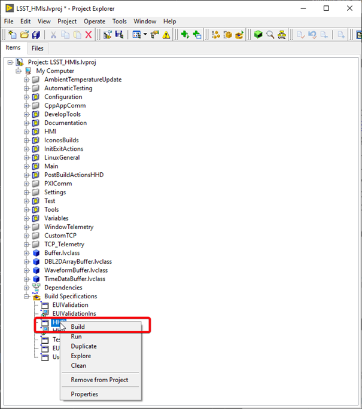

- Build the HHD installer.

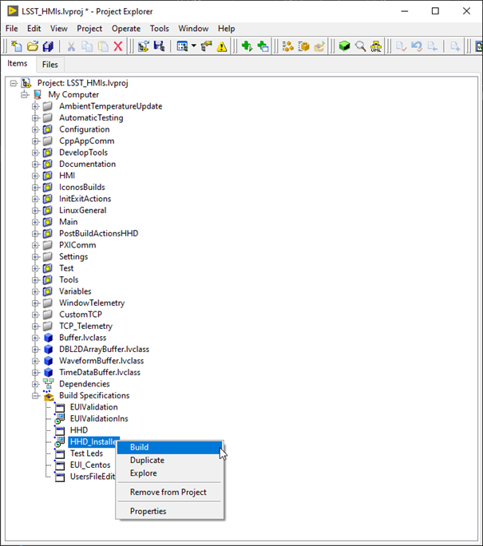

- Execute the installer at the HHD.
- Configure the HHD IP using the "CommArchitecture" document.
- Configure the HHD application to run on start up.

## TMA PXI

### TMA PXI set up

Ensure that the PXI is configured as shown in Table 3 and has the software from Table 4 installed.

| **SYSTEM CONFIGURATION** | |
| --- |---|
| **Hostname** | TMA-PXI |
| **DNS Name** | TMA-PXI |
| **Vendor** | National Instruments |
| **Model** | PXIe-8880 |
| **Serial Number** | 2F23AA3D |
| **Firmware Version** | 8.8.0f0 |
| **Operating System** | NI Linux Real-Time x64 4.14.146-rt67-cg-8.0.0f1-x64-139 |
| **System Start Time** | 05/09/2022 15:48:05 |
| **Comments** | None |
| **Locale** | English |
| **Halt on IP failure** | False |

| **INSTALLED SOFTWARE** | **VERSION** |
| --- | --- |
| **NI Scan Engine** | 9.0.0.49152-0+f0 |
| **LabVIEW Real-Time** | 20.0.0.49154-0+f4 |
| **Network Streams** | 20.0.0.49156-0+f4 |
| **Run-Time Engine for Web Services** | 20.0.0.49152-0+f0 |
| **Variable Legacy Protocol Support** | 5.12.0.49154-0+f2 |
| **NI PXI Platform Services** | 20.0.0.49152-0+f0 |
| **NI-Watchdog** | 20.0.0.49152-0+f0 |
| **Variable Legacy Server Support** | 5.12.0.49154-0+f2 |
| **Variable Client Support for LabVIEW RT** | 20.0.0.49153-0+f1 |
| **NI-RIO IO Scan** | 20.0.0.49152-0+f0 |
| **NI System Configuration** | 20.0.0.49152-0+f0 |
| **NI-Industrial Communications for EtherCAT** | 20.0.0.49152-0+f0 |
| **NI System Configuration Remote Support** | 20.0.0.49152-0+f0 |
| **NI-RIO** | 20.0.0.49153-0+f1 |
| **NI-RIO Server** | 20.0.0.49153-0+f1 |
| **WebDAV Server** | 20.0.0.49152-0+f0 |
| **NI Scan Engine** | 9.0.0.49152-0+f0 |

#### TMA Copy required files to the PXI

##### TMA Libraries

Copy the following libraries to the `/usr/local/lib` folder inside the PXI.

Library list:

- `EIB8Driver32.so*`
- `libEIB8Driver.so*`
- `libGetClocks.so*`
- `libaci.so*`
- `libcrypto.so.1.0.0*`
- `libmlpi.so*`
- `libssl.so.1.0.0*`
- `libtrajectory.so*`
- `lvimptsl.so*`

##### MLPI files

First copy the `libmlpi.so` to `/usr/local/lib` and then create a softlink in the `/c/ni-rt` folder called system, as follows.

```bash
cd /c/ni-rt

ln -s /usr/local/lib/ system
```

#### TMA PTP configuration

Follow next steps to configure the ptp in the PXI.

- Install ptp

```bash
opkg install linuxptp
```

- Copy the `ptp4l.conf` to `/etc/ folder`. In the configuration file shown next the eno1 is the name of the main network interface

```bash
[global]

verbose 1

time_stamping hardware

priority1 250

priority2 250

[eno1]
```

- Copy the `ptpScript` to the folder `etc/init.d`

```bash
#!/bin/bash

NAME="PTP DAEMON"
PIDFILE=/var/run/ptpdaemon.pid
do_start() {
/sbin/start-stop-daemon --start --pidfile $PIDFILE --make-pidfile --background --chuid admin --exec /usr/bin/ptp4l -- -f /etc/ptp4l.conf
}
do_stop() {
/sbin/start-stop-daemon --stop --pidfile $PIDFILE --verbose
}
case "$1" in
start)
echo "Starting $NAME"
do_start
;;
stop)
echo "Stopping $NAME"
do_stop
;;
restart)
echo "Restarting $NAME"
do_stop
do_start
;;
*)
echo "Usage: $0 {start|stop|restart}"
exit 1
;;
esac
exit 0
```

- Copy the `phcScript` to the folder `etc/init.d`

```bash
#!/bin/bash

NAME="PHC DAEMON"
PIDFILE=/var/run/phcdaemon.pid
do_start() {
/sbin/start-stop-daemon --start --pidfile $PIDFILE --make-pidfile --background --chuid admin --exec /usr/bin/phc2sys -- -a -r
}
do_stop() {
/sbin/start-stop-daemon --stop --pidfile $PIDFILE --verbose
}
case "$1" in
start)
echo "Starting $NAME"
do_start
;;
stop)
echo "Stopping $NAME"
do_stop
;;
restart)
echo "Restarting $NAME"
do_stop
do_start
;;
*)
echo "Usage: $0 {start|stop|restart}"
exit 1
;;
esac
exit 0
```

- Make the files executables with chmod +x (both files)

```bash
chmod +x /etc/ptp4l.conf

chmod +x /etc/init.d/ptpScript

chmod +x /etc/init.d/phcScript
```

- Install as startup script with default settings using

```bash
/usr/sbin/update-rc.d -f ptpScript defaults
```

- Reboot target and check that PTP is running

```bash
pmc -u -b 0 'GET TIME\_STATUS\_NP'

cat /var/log/messages
```

### TMA Deploying the code to the PXI

Steps for deploying the code to the TMA PXI:

- Download the [PXI repository](https://gitlab.tekniker.es/aut/projects/3151-LSST/LabVIEWCode/PXIController)
- Open the `LSST_MainControllerPXI.lvproj`.
  - Open the Main.
  - Solve the requested dependencies if they appear.
  - Close the main.
  - Save all the request files.
- Configure etherCAT ring.
  - Connect just 1 end of the etherCAT ring, recommended 4 slot B port cable connected and 3 slot B port disconnected.
  - To ensure that the ethercat line is displayed correctly the ESI files from the repo must be imported to labview.
    - Right click on the ethercat master -> Utilities -> Import Device Profiles…
    - Here select the ESI files to import. Import all the files from the [this folder](https://gitlab.tekniker.es/aut/projects/3151-LSST/LabVIEWCode/PXIController/tree/master/ESIFiles)
    - Select only the import to the host computer option.
    - Click import.
    - Close the window.
  - Deploy the etherCAT master to the PXI.
  - Connect the etherCAT ring, if the recommended port was disconnected connect the 3 slot B port cable.
  - Execute the EtherCAT_RingConfig.vi, from [this folder](https://gitlab.tekniker.es/aut/projects/3151-LSST/LabVIEWCode/PXIController/tree/develop/Host%20Code/Tools/EtherCAT)
    - Check if the redundancy is active, if active skip next 2 steps, usually is not.
  - Restart PXI.
  - Execute the EtherCAT_RingConfig.vi, from [this folder](https://gitlab.tekniker.es/aut/projects/3151-LSST/LabVIEWCode/PXIController/tree/develop/Host%20Code/Tools/EtherCAT)
    - Check if the redundancy is active, at this step it must be active.
  - Check online master state to ensure that all devices are okay.
  - If all the devices are okay the ring is ready.
- Build the rtexe.
- Deploy the rtexe to the target and set it to run on start up.

### EIB Configuration files

For using the EIB TMA PXI must have the EIB configuration file located inside the PXI. The default path is: `/c/Configuration/EIB multi_ext.txt` this can be changed by a setting from the database.

Copy the file from the `PXIController\ESIFiles\EIB` folder to the PXI using `scp`.

## Axes PXI

### Axes PXI set up

Ensure that the PXI is configured as shown in Table 5 and has the software from Table 6 installed.

| **SYSTEM CONFIGURATION** | |
| --- | --- |
| **Hostname** | AxesPXI |
| **DNS Name** | AxesPXI |
| **Vendor** | National Instruments |
| **Model** | PXIe-8880 |
| **Serial Number** | 2F23EB99 |
| **Firmware Version** | 8.8.0f0 |
| **Operating System** | NI Linux Real-Time x64 4.14.146-rt67-cg-8.0.0f1-x64-139 |
| **System Start Time** | 27/06/2019 11:42:28 |
| **Comments** | None |
| **Locale** | English |
| **Halt on IP failure** | False |

| **INSTALLED SOFTWARE** | **VERSION** |
| --- | --- |
| **NI Scan Engine** | 9.0.0.49152-0+f0 |
| **LabVIEW Real-Time** | 20.0.0.49154-0+f4 |
| **Network Streams** | 20.0.0.49156-0+f4 |
| **Network Variable Engine** | 20.0.0.49153-0+f1 |
| **Run-Time Engine for Web Services** | 20.0.0.49152-0+f0 |
| **NI PXI Platform Services** | 20.0.0.49152-0+f0 |
| **NI-Watchdog** | 20.0.0.49152-0+f0 |
| **Variable Client Support for LabVIEW RT** | 20.0.0.49153-0+f1 |
| **NI-RIO IO Scan** | 20.0.0.49152-0+f0 |
| **NI System Configuration** | 20.0.0.49152-0+f0 |
| **NI-Industrial Communications for EtherCAT** | 20.0.0.49152-0+f0 |
| **NI System Configuration Remote Support** | 20.0.0.49152-0+f0 |
| **NI-RIO** | 20.0.0.49153-0+f1 |
| **NI-RIO Server** | 20.0.0.49153-0+f1 |
| **WebDAV Server** | 20.0.0.49152-0+f0 |

#### Axes Copy required files to the PXI

##### Axes Libraries

Copy the following libraries to the `/usr/local/lib` folder inside the PXI.

Library list:

- `libGetClocks.so*`
- `libaci.so*`
- `libssl.so.1.0.0*`
- `libtrajectory.so*`
- `lvimptsl.so*`

#### PTP configuration Axes

The PTP is configured in the same way as done for the TMA-PXI, see [here](#tma-ptp-configuration).

#### Axes Deploying the code to the PXI

Steps for deploying the code to the TMA PXI:

- Download the PXI [repository](https://gitlab.tekniker.es/aut/projects/3151-LSST/LabVIEWCode/PXIController)
- Open the `MainAxesPXI.lvproj`.
  - Open the Main.
  - Solve the requested dependencies if they appear.
  - Close the main.
  - Save all the request files.
- Configure etherCAT ring.
  - Connect just 1 end of the etherCAT ring, recommended 4 slot B port cable connected and 3 slot B port disconnected.
  - To ensure that the ethercat line is displayed correctly the ESI files from the repo must be imported to labview.
    - Right click on the ethercat master -> Utilities -> Import Device Profiles…
    - Here select the ESI files to import. Import all the files from the [this folder](https://gitlab.tekniker.es/aut/projects/3151-LSST/LabVIEWCode/PXIController/tree/master/ESIFiles)
    - Select only the import to the host computer option.
    - Click import.
    - Close the window.
  - Deploy the etherCAT master to the PXI.
  - Connect the etherCAT ring, if the recommended port was disconnected connect the 3 slot B port cable.
  - Execute the `EtherCAT_RingConfig.vi`, from [this folder](https://gitlab.tekniker.es/aut/projects/3151-LSST/LabVIEWCode/PXIController/tree/develop/Host%20Code/Tools/EtherCAT)
    - Check if the redundancy is active, if active skip next 2 steps, usually is not.
  - Restart PXI.
  - Execute the `EtherCAT_RingConfig.vi`, from [this folder](https://gitlab.tekniker.es/aut/projects/3151-LSST/LabVIEWCode/PXIController/tree/develop/Host%20Code/Tools/EtherCAT)
    - Check if the redundancy is active, at this step it must be active.
  - Check online master state to ensure that all devices are okay.
  - If all the devices are okay the ring is ready.
- Build the rtexe.
- Deploy the rtexe to the target and set it to run on start up.

### Ethercat cRIO 9144

Steps for setting up the cRIO:

- Open the `LSST_MainControllerPXI.lvproj`.
- Connect to the PXI and change it to Configuration.
- Navigate to the cRIO at the etherCAT line build the MainFPGA.
- Download the MainFPGA.

### Trajectory generation

The trajectory generation is developed by Tekniker. The code is stored in [this repo](https://gitlab.tekniker.es/aut/projects/3151-LSST/trajectories/trayectorias).

## AuxSystems PXI

### AuxSystems PXI set up

Ensure that the PXI is configured as shown in Table 5 and has the software from Table 6 installed.

| **SYSTEM CONFIGURATION** | |
| --- | --- |
| **Hostname** | AuxSystems |
| **DNS Name** | AuxSystems.local |
| **Vendor** | National Instruments |
| **Model** | PXIe-8880-Beckhoff |
| **Serial Number** | 2F23EB99 |
| **Firmware Version** | 8.8.0f0 |
| **Operating System** | NI Linux Real-Time x64 4.14.146-rt67-cg-8.0.0f1-x64-139 |
| **System Start Time** | 27/06/2019 11:42:28 |
| **Comments** | None |
| **Locale** | English |
| **Halt on IP failure** | False |

| **INSTALLED SOFTWARE** | **VERSION** |
| --- | --- |
| **LabVIEW Real-Time** | 20.0.0.49154-0+f4 |
| **Network Variable Engine** | 20.0.0.49153-0+f1 |
| **Run-Time Engine for Web Services** | 20.0.0.49152-0+f0 |
| **Variable Legacy Protocol Support** | 5.12.0.49154-0+f2 |
| **Variable Legacy Server Support** | 5.12.0.49154-0+f2 |
| **Variable Client Support for LabVIEW RT** | 20.0.0.49153-0+f1 |
| **NI System Configuration Remote Support** | 20.0.0.49152-0+f0 |
| **WebDAV Server** | 20.0.0.49152-0+f0 |

#### AuxSystems Copy required files to the PXI

##### AuxSystems Libraries

Copy the following libraries to the `/usr/local/lib` folder inside the PXI.

Library list:

- `libGetClocks.so*`

#### AuxSystems PTP configuration

The PTP is configured in the same way as done for the TMA-PXI, see [here](#tma-ptp-configuration).

### AuxSystems deploying the code to the PXI

Steps for deploying the code to the TMA PXI:

- Download the PXI [repository](https://gitlab.tekniker.es/aut/projects/3151-LSST/LabVIEWCode/PXIController)
- Open the `AuxSystemsController.lvproj`.
  - Open the Main.
  - Solve the requested dependencies if they appear.
  - Close the main.
  - Save all the request files.
- Build the rtexe.
- Deploy the rtexe to the target and set it to run on start up.

## Bosch Rexroth drive system

First the Ethernet configuration in the MLC must be set. Follow next steps to perform the IP change

- Power on MLC
- Move with `Enter` from the standard display **BB STOP** to the **ETHERNET** display.
- Press `Enter` again to go to the **IP address**.
- Press `Enter` again to change the preset address. The IP address must be 192.168.212.3
- Change its section of the IP address value with `DOWN` or `UP` and continue to next section with `Enter`.
  The individual blocks flash to visualize the change. This is first change the section `XXX.` to `192.`, then `192.XXX.` to `192.168.` and so on.
- After the fourth block, press `Enter` to trigger the query: "OK : ?. Confirm with `Enter`. The change is applied and the **ETHERNET** display opens. If `Esc` is pressed during the change, the change is discarded!
- Change the subnet mask to 255.255.255.0 and the gateway to 192.168.212.253 address analogously
- Reboot MLC to apply Ethernet settings.

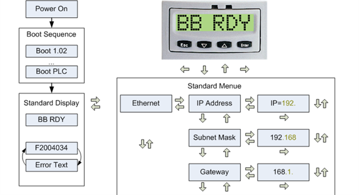

Now, Indraworks Engineering tool is able to connect to MLC. Follows next steps for setting up the configuration in the MLC.

- Download the Indraworks [repository](https://gitlab.tekniker.es/aut/projects/3151-LSST/harwareconfigurations/indraworks)
- Open the indraworks project
- Connect to the MLC from the indraworks tool and deploy the project

## Watlow temperature controller

In this section steps for setting up the temperature controller can be found. The temperature controller is composed by two different components

- RMC. The temperature controller itself
- RMA. A communication module for RMC, that makes the RMC accessible using modus TCP.

Both are configured in the same way

- Connect a RS485 cable to RMC or RMA
  - Connection to RMC in the button of the RMC
    - Data+ to Pin
    - Data- to Pin
    - Common to Pin
  - Connection to RMC in the button of the RMC
    - Data+ to Pin
    - Data- to Pin
    - Common to Pin
- Download the configuration files placed in the [repository](https://gitlab.tekniker.es/aut/projects/3151-LSST/harwareconfigurations/watlowconfiguration.git)
- Open the tool EZ-Zone Configurator 6.1 and click `Next` in the welcome window with the option `Download a configuration file in to a device`

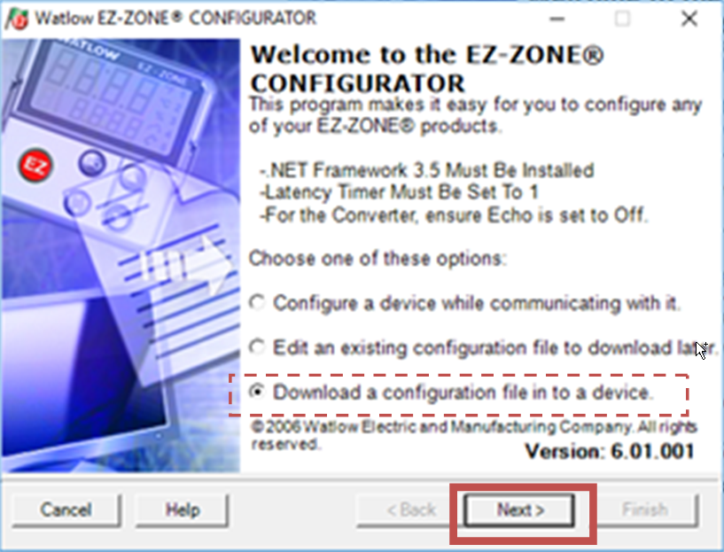

- Select the proper com and click `Next`

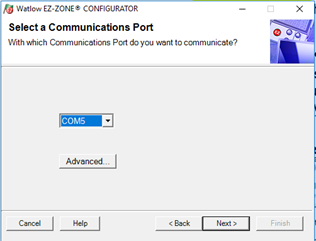

- Chose the element to connect, RMC or RMA and click `Next`

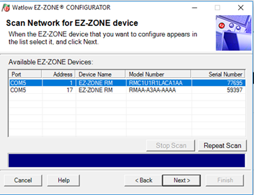

- Chose the file
  - `RMC_Configuration.wcf` for RMC
  - `RMA_Configuration.wcf` for RMA

## Phoenix Contact IOs

- Download the configuration files placed in the [repository](https://gitlab.tekniker.es/aut/projects/3151-LSST/LabVIEWCode/PXIController.git) in the folder `\PXIController\ESIFiles\Phoenix\IOConfiguration`.
- Connect to the desired header using a usb to micro usb cable. See images bellow to find the connection point in the IO header
- Open startup+ from Phoenix Contact, v2.6.
- When opening chose to load an existing project or click open project form file menu or task bar

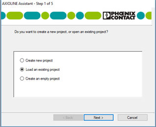
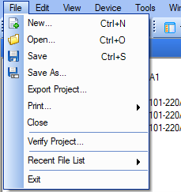


- Navigate to file corresponding to connected IOs. The files are named with the name of the cabinet, and for cabinet TMA-AZ-CS-CBT-0101 there are two files, one with suffix 220A1 and the other with suffix 220A2 for modules with the same name inside this cabinet.
- Chose the header and right click.
  - Select parameters->Download all parameters
